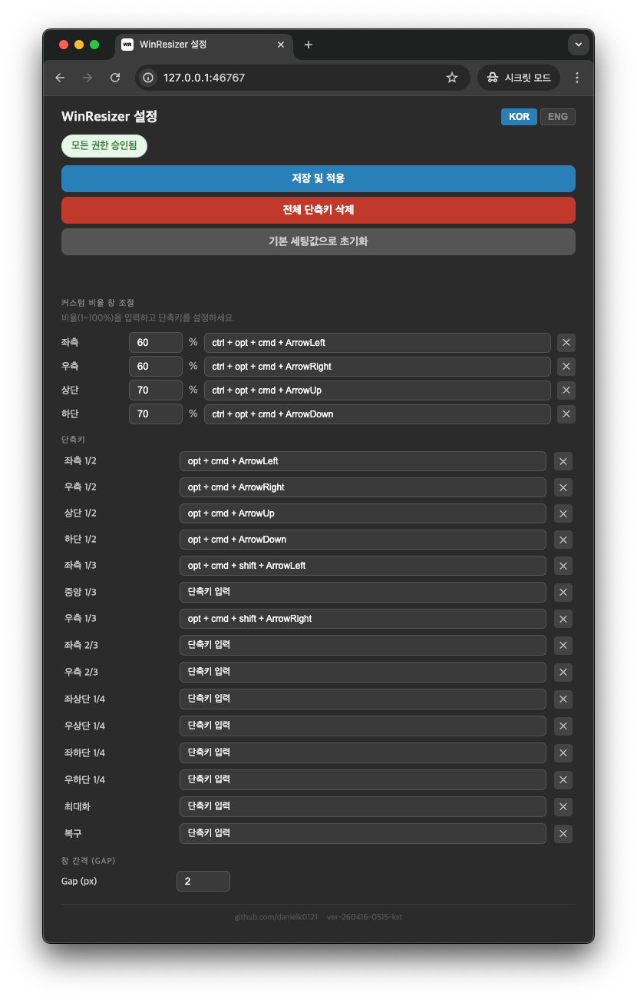

# winresizer-go

macOS 창 크기/위치를 글로벌 단축키로 조절하는 트레이 앱. Python 구현체를 Go로 포팅하여 배포 단순화 및 성능 개선을 목표로 합니다.

## 주요 특징

- **글로벌 단축키**: 창을 화면의 절반, 1/3, 2/3, 사분면 등으로 즉시 배치
- **스마트 사이클링**: 동일 단축키 반복 입력 시 미리 정의된 비율로 순환 (예: 1/2 -> 2/3 -> 1/3)
- **멀티모니터 지원**: 창이 위치한 모니터를 자동 인식하여 해당 화면 기준으로 동작
- **브라우저 기반 설정 UI**: 메뉴바 아이콘 클릭 시 로컬 웹 서버를 통해 설정 페이지 제공
- **단일 바이너리 배포**: CGo를 활용한 macOS 네이티브 API 호출 (~15–25 MB)
- **포커스 유지 및 최소 크기 대응**: 창 크기 조절 시 포커스 유실 방지 및 앱별 최소 크기 제약 자동 처리

## 요구사항

| 항목 | 내용 |
|---|---|
| OS | macOS 12.0 이상 (Intel / Apple Silicon) |
| Go | 1.22 이상 |
| 기타 | Xcode Command Line Tools (CGo 빌드용) |

## 스크린샷



## 설치 및 실행 (Quick Guide)

```bash
# 1. 소스코드 복사
git clone https://github.com/user/winresizer-go.git
cd winresizer-go/app

# 2. 의존성 설치 및 빌드
go build -o winresizer .

# 3. 실행
./winresizer
```

- **앱 번들 빌드**: `build-work/build.sh` 스크립트를 사용하여 `.app` 및 `.dmg`를 생성할 수 있습니다.
- **최초 실행 시**: macOS 시스템 설정에서 **'손쉬운 사용(Accessibility)'** 및 **'입력 모니터링(Input Monitoring)'** 권한 허용이 필요합니다.

## 프로젝트 구조

```text
winresizer-go/
├── app/                    # Go 소스코드 루트
│   ├── main.go             # 앱 진입점 및 고루틴 오케스트레이션
│   ├── config/             # 기본 설정 파일 (default-config.json)
│   ├── core/               # 핵심 로직 (CGo, 창 제어, 단축키 리스너, 설정 관리)
│   ├── server/             # Gin 기반 설정 웹 서버 및 API 핸들러
│   ├── ui/                 # 메뉴바 트레이 UI 및 프론트엔드 자원 (HTML/CSS/JS)
│   └── utils/              # 로거 및 공통 유틸리티
├── build-work/             # .app 번들 빌드, 아이콘 생성, 코드 서명 스크립트
├── doc/                    # 설계 문서, 작업 기록 (ing/done/hold/discard)
└── e2e_screenshots/        # UI 테스트 및 기능 확인용 스크린샷
```

## 주요 진입점

- `app/main.go`: 전체 프로세스의 시작점으로 웹 서버, 단축키 매니저를 실행하고 시스템 트레이를 구동합니다.
- `app/core/hotkey_listener_darwin.go`: Carbon API를 통해 글로벌 단축키를 감지하는 저수준 브릿지입니다.
- `app/core/window_controller_darwin.go`: Accessibility API를 사용하여 실제 창의 위치와 크기를 물리적으로 조절합니다.
- `app/server/web_server.go`: 사용자가 단축키 및 일반 설정을 변경할 수 있는 HTTP 서버를 관리합니다.
- `app/ui/tray.go`: macOS 메뉴바의 아이콘 표시 및 클릭 시 브라우저 호출 로직을 담당합니다.

## Go 개발 참고

### 테스트 파일 위치
Go는 별도 `tests/` 폴더를 만들지 않습니다. 테스트 파일은 소스 파일과 **같은 폴더**에 `_test.go` 접미사로 작성합니다.

```
core/
├── window_controller.go
├── window_controller_test.go   ← 테스트 파일
├── hotkey_listener.go
└── hotkey_listener_test.go     ← 테스트 파일
```

```bash
# 특정 패키지 테스트
go test ./core/...

# 전체 테스트
go test ./...
```

## 설정 파일 구조 (default-config.json vs config.json)

파이썬 구현체와 동일하게 **2개 파일** 구조를 사용합니다.

| 파일 | 위치 | 역할 |
|---|---|---|
| `default-config.json` | `app/config/default-config.json` (소스 내장) | 앱 기본값 정의. 소스코드에 포함되어 배포됨 |
| `config.json` | `~/Library/Application Support/WinResizer/config.json` | 사용자 실제 설정. 런타임에 생성/수정됨 |

**동작 흐름:**

```text
앱 시작
  └─ config.json 존재?
       ├─ YES → config.json 로드 (사용자 설정 사용)
       └─ NO  → default-config.json 로드 → config.json으로 복사 생성
```

- `default-config.json`은 읽기 전용 기준값입니다. 앱이 직접 수정하지 않습니다.
- 사용자가 설정 UI에서 변경하면 `config.json`에만 저장됩니다.
- `POST /api/config/reset` 호출 시 `default-config.json` 값을 응답으로 반환하지만, `config.json` 파일은 덮어쓰지 않습니다 (설계 의도).
- 관련 구현: `app/core/config_manager.go` — `LoadConfig()`, `LoadDefaultConfig()`

## 실행 중 프로세스 구성

WinResizer는 효율적인 동시성 처리를 위해 3개의 주요 고루틴으로 운영됩니다.

1. **Main Goroutine (systray)**: macOS의 제약에 따라 메인 스레드를 점유하며 메뉴바 아이콘 및 메뉴 이벤트를 처리합니다.
2. **HotkeyListener (Carbon Loop)**: 별도 고루틴에서 Carbon 이벤트 루프(`ReceiveNextEvent`)를 실행하여 OS 레벨의 단축키 입력을 대기합니다.
3. **WebServer (Gin Server)**: 사용하지 않는 임의의 포트(40000~49999)를 할당받아 설정 UI와 API를 제공합니다.

## 웹 서버 엔드포인트

| Method | Path | Description |
|---|---|---|
| `GET` | `/` | 설정 웹 UI 메인 페이지 (index.html) |
| `GET` | `/api/status` | 앱 상태 정보 (권한 부여 여부, PID 등) 반환 |
| `GET` | `/api/config` | 현재 활성화된 `config.json` 정보 반환 |
| `POST` | `/api/config` | 새로운 설정을 저장하고 단축키 리스너를 즉시 재시작 |
| `POST` | `/api/config/reset` | `default-config.json`의 기본값 반환 |
| `GET/POST` | `/api/execute` | `mode` 파라미터를 통해 즉시 창 조절 명령 실행 |

## 로그 파일 경로

로거는 파일과 표준 출력(stdout)에 동시에 기록하며, 날짜별로 롤링됩니다.

- **로그 폴더**: `~/Library/Application Support/WinResizer/log/`
- **파일명 형식**: `winresizer_YYYY-MM-DD.log` (예: `winresizer_2026-04-16.log`)

## 데이터 플로우

### 1. 단축키 입력 흐름 (Hotkey Execution)
```text
[사용자 키 입력] 
   ↓ (OS 레벨 감지)
[Carbon Event Loop] (core/hotkey_listener_darwin.c)
   ↓ (CGo Callback)
[Go Callback Handler] (core/hotkey_listener_darwin.go)
   ↓ (명령어 매칭)
[ExecuteWindowCommand] (core/window_controller_darwin.go)
   ↓ (Accessibility API 호출)
[대상 창 위치/크기 변경]
```

### 2. 설정 변경 흐름 (Configuration Update)
```text
[Web UI (Browser)] 
   ↓ (POST /api/config)
[API Handler] (server/handlers.go)
   ↓ (파일 저장 및 캐시 갱신)
[SaveConfig] (core/config_manager.go)
   ↓ (비동기 트리거)
[RestartHotkeyManager]
   ↓ (기존 해제 및 신규 등록)
[UnregisterAllHotkeys] -> [RegisterHotkey]
```

## 필수 권한 설정 (macOS 2단계 가이드)

앱이 창을 제어하고 단축키를 감지하려면 다음 권한이 반드시 필요합니다.

1. **손쉬운 사용 (Accessibility)**: 다른 앱의 창 크기를 조절하기 위해 필요합니다.
   - `시스템 설정` > `개인정보 보호 및 보안` > `손쉬운 사용` > `winresizer` 허용
2. **입력 모니터링 (Input Monitoring)**: 글로벌 단축키 입력을 감지하기 위해 필요합니다.
   - `시스템 설정` > `개인정보 보호 및 보안` > `입력 모니터링` > `winresizer` 허용

## 자주 묻는 질문 (FAQ)

**Q: 단축키를 눌러도 창이 반응하지 않습니다.**
A: 상기 '필수 권한 설정'이 모두 허용되었는지 확인하십시오. 이미 허용되어 있다면 권한을 껐다가 다시 켜보시기 바랍니다.

**Q: 창이 화면 밖으로 나가거나 이상한 위치로 이동합니다.**
A: 멀티 모니터 사용 중 모니터를 연결 해제하거나 해상도를 변경한 경우 발생할 수 있습니다. 앱을 재시작하면 현재 디스플레이 구성을 다시 스캔합니다.

**Q: 특정 앱의 창 크기가 조절되지 않습니다.**
A: 해당 앱이 지원하는 '최소 창 크기'보다 작게 조절하려 할 때 발생할 수 있습니다. WinResizer는 앱의 최소 제약을 존중하며 가능한 최대치까지 조절을 시도합니다.
